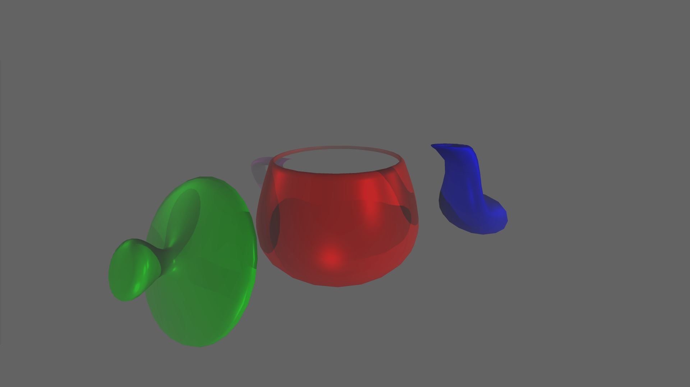

# SoftwareRenderer
software renderer for IRIT 3d object files

Features:
- wireframe/solid rendering (Bresenham lines/polygon scan lines)
- Orthogonal/Perspective projections
- silhouette highlighting
- up to 8 light sources (directional/point/spot) with diffuse and specualr lighting
- ambient lighting
- Flat/Gouraud/Phong shading
- Translation/Rotation/Scale transformations in Global/Model view
- Object hierarchy with support for individual object transformations
- Polygon/Vertex normal calculation and highlighting
- Render scene to png file
- Z buffer rendering
- Back face culling
- many other smaller features

Demo Renders:

